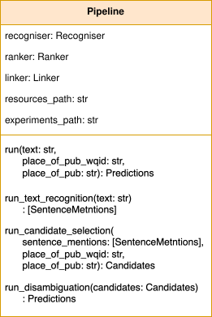

# T-Res Pipeline

The T-Res codebase contains three main classes: 

 - the **Recogniser** class (which performs toponym recognition, which is a named entity recognition task), 
 - the **Ranker** class (which performs candidate selection and ranking for the named entities identified by the Recogniser),
 - the **Linker** class (which selects the most likely candidate from those provided by the Ranker).

An additional class, the **Pipeline**, wraps these three components into one, therefore making it easier for the user to perform end-to-end entity linking.

Here we provide a step-by-step guide to instantiating and using the T-Res Pipeline. We recommend that you first try to run T-Res using the default pipeline, and then change it according to your needs.

!!! Warning

    Before being able to run the pipeline, you will need to make sure you have all the required resources. Refer to the "[Resources & directory structure](resources.md)" page in the documentation.

## Pipeline Class

To perform toponym resolution with the T-Res pipeline you must first construct an instance of the `Pipeline` class, as explained in [Section 1](#1-instantiate-the-pipeline) below. The following diagram shows the class structure, which consists of a single `Pipeline` class which is composed of a [`Recogniser`](recogniser.md), [`Ranker`](ranker.md) and [`Linker`](linker.md) instance.

The `run` method executes the end-to-end pipeline. The result of this is equivalent to running the three steps separately using the methods `run_text_recognition`, `run_candidate_selection` and `run_disambiguation`.

&nbsp;

<figure markdown="1">
{ width="260" } 
</figure>

## 1. Instantiate the Pipeline

By default, the Pipeline instantiates:

-   a Recogniser (from a HuggingFace model),
-   a Ranker (using the ``perfectmatch`` approach), and
-   a Linker (using the ``mostpopular`` approach).

To instantiate the default T-Res pipeline, do:

```python
from t_res.geoparser import pipeline

geoparser = pipeline.Pipeline(
    resources_path="../resources/"
)
```

!!! title "Note"

    You should update the resources path argument to reflect your set up.

You can also instantiate a pipeline using a customised Recogniser, Ranker and Linker. To see the different options, refer to the sections on instantiating each of them: [Recogniser](#recogniser), [Ranker](#ranker) and [Linker](#linker).

In order to instantiate a pipeline using a customised Recogniser, Ranker and Linker, just instantiate them beforehand, and then pass them as arguments to the Pipeline, as follows:

```python
from geoparser import pipeline, ner, ranking, linking

recogniser = ner.Recogniser(...)
ranker = ranking.Ranker(...)
linker = linking.Linker(...)

geoparser = pipeline.Pipeline(recogniser=recogniser, ranker=ranker, linker=linker)
```

!!! Warning

    Note that the default Pipeline expects to be run from the `experiments/` or the `examples` folder (or any other folder in the same level). The Pipeline will look for the resources at `../resources/`. Make sure all the required resources are in the right locations.

!!! title "Note"

    If a model needs to be trained, the Pipeline itself will take care of it. Therefore, you should expect that the first time the Pipeline is used (or if you change certain input parameters) T-Res will take some time before it is ready to be used for prediction, as it will train the models if the approaches require so.

## 2. Use the Pipeline

Once instantiated (and once all the models have been trained or loaded, if needed), the Pipeline can be used to perform end-to-end toponym recognition and linking (given an input text) or to perform each of the three steps individually: 

 1. toponym recognition given an input text, 
 2. candidate selection given a toponym or list of toponyms, and 
 3. toponym disambiguation given the output from the first two steps.

### End-to-end pipeline

The Pipeline can be used to perform end-to-end toponym recognition and linking given an input text, using the [`run()`][t_res.geoparser.pipeline.Pipeline.run] method (which takes care of splitting a text into sentences, before running the pipeline on each sentence).

!!! example "Example: Pipeline `run()` method"
    ```python
    output = geoparser.run("Inspector Liddle said: I am an inspector of police, living in the city of Durham.")
    ```

The following parameters are optional:

-   `place_of_pub_wqid`: The Wikidata ID of the place of publication (e.g. `"Q84"`).
-   `place_of_pub`: The place of publication associated with the text document as a human-legible string (e.g. `"London"`).

[](){#predictions-output}

!!! example "Example: Pipeline `run()` method including place of publication"
    ```python
    output = geoparser.run("Inspector Liddle said: I am an inspector of police, living in the city of Durham.",
        place_of_pub_wqid="Q2560190",
        place_of_pub="Alston, Cumbria, England",
    )
    ```

When printed, the output looks like this:
```python
Predictions for text: 'Inspector Liddle said:...city of Durham.':
    Durham => Durham [1.000]: Q179815 (0.439), Q49229 (0.216), Q23082 (0.071), ...
```

In the above output, the first line indicates that the this is an instance of the [`Predictions`][t_res.utils.dataclasses.Predictions] dataclass, and includes a snippet of the text that has been processed. Then there is a line for each toponym identified in the text (in this case only one, Durham).

Each of these lines has the following format:
```bash
    mention => string_match [string_similarity]: WQID1 (score1), WQID2 (score2), WQID3 (score3), ...
```
where:

 - `mention` is the identified toponym mention, exactly as found in the text
 - `string_match` is the **best** string match found for the toponym mention
 - `string_similarity` is the string matching similarity score
 - `WQID1` is the Wikidata ID of the **best** link found in the knowledgebase
 - `score1` is the disambiguation score (i.e. confidence) for the link `WQID1`
 - `WQID2`, `score2` and `WQID3`, `score3` are the IDs and scores for the second- and third-best links, respectively
 - if present, the ellipsis `...` indicates that additional (poorer) links were identified but are not shown.

Thus, the printed output provides a summary of the toponyms resolved from the given text. To interrogate the output more closely, see the documentation for the [`Predictions`][t_res.utils.dataclasses.Predictions] dataclass for a list of all available methods.

### Step-by-step pipeline

**Step 1: Named Entity Recognition.** See how to perform toponym recognition with the Pipeline, with an example:

```python
mentions = geoparser.run_text_recognition(text="Inspector Liddle said: I am an inspector of police, living in the city of Durham.")
```

This call produces a list of instances of the [`SentenceMentions`][t_res.utils.dataclasses.SentenceMentions] dataclass, one for each sentence in the text. In this case there is a single sentence. When printed, the result looks like this:

```python
Toponym mentions for sentence: 'Inspector Liddle said: I am an inspector of police, living in the city of Durham.'
    Durham LOC chars: 74-80 confidence: 0.999
```

In the above output there is a line for each toponym mention found in the text (in this case only one, Durham).

Each of these lines has the following format:
```bash
    mention => ner_label chars: start-end confidence: string_similarity
```
where:

 - `mention` is the identified toponym mention, exactly as found in the text
 - `ner_label` is the NER label for this mention (e.g. `LOC` indicates this is a location)
 - `chars: start-end` is the character span of the toponym mention within the sentence
 - `confidence: string_similarity` is the similarity (confidence) score of the string match.

To interrogate the output more closely, see the documentation for the [`SentenceMentions`][t_res.utils.dataclasses.SentenceMentions] dataclass for a list of all available methods.


**Step 2: Candidate Selection.** See how to perform candidate selection given the `mentions` output from the previous step, with an example:

```python
candidates = geoparser.run_candidate_selection(
    mentions,
    place_of_pub_wqid="Q2560190",
    place_of_pub="Alston, Cumbria, England",
)
```

This is the printed output for this example:
```python
Candidates for text: 'Inspector Liddle said:...city of Durham.':
    Durham => Durham [1.000]: Q1137286, Q5316477, Q752266, ...
```
It is an instance of the [`Candidates`][t_res.utils.dataclasses.Candidates] dataclass, and resembles the output [displayed above][predictions-output] for the [`Predictions`][t_res.utils.dataclasses.Predictions] dataclass (which is a subclass of `Candidates`), except that the entity linking disambiguation scores are omitted, because they have not yet been computed. 

**Step 3: Disambiguation.** Finally, see how to perform toponym disambiguation given the output from the two previous steps, with this example:

```python
predictions = geoparser.run_disambiguation(candidates)
```

This will produce the exact same output as we [obtained above][predictions-output] when running the pipeline end-to-end.

#### Description of the output

The output of running the pipeline (both using the end-to-end method or in a step-wise manner, regardless of the methods used for each of the three components), will have the following format:

``` json
[{"mention": "Durham",
  "ner_score": 0.999,
  "pos": 74,
  "sent_idx": 0,
  "end_pos": 80,
  "tag": "LOC",
  "sentence": "Inspector Liddle said: I am an inspector of police, living in the city of Durham.",
  "prediction": "Q179815",
  "ed_score": 0.039,
  "cross_cand_score": {
    "Q179815": 0.396,
    "Q23082": 0.327,
    "Q49229": 0.141,
    "Q5316459": 0.049,
    "Q458393": 0.045,
    "Q17003433": 0.042,
    "Q1075483": 0.0
  },
  "string_match_score": {"Durham": [1.0, ["Q1137286", "Q5316477", "Q752266", "..."]]},
  "prior_cand_score": {
    "Q179815": 0.881,
    "Q49229": 0.522,
    "Q5316459": 0.457,
    "Q17003433": 0.455,
    "Q23082": 0.313,
    "Q458393": 0.295,
    "Q1075483": 0.293
  },
  "latlon": [54.783333, -1.566667],
  "wkdt_class": "Q515"}]
```

Description of the fields:

-   `mention`: The mention text.
-   `ner_score`: The NER confidence score of the mention.
-   `pos`: The starting position of the mention in the sentence.
-   `sent_idx`: The index of the sentence.
-   `end_pos`: The ending position of the mention in the sentence.
-   `tag`: The NER label of the mention.
-   `sentence`: The input sentence.
-   `prediction`: The predicted entity linking result (a Wikidata QID or NIL).
-   `ed_score`: The entity disambiguation score.
-   `string_match_score`: A dictionary of candidate entities and their string matching confidence scores.
-   `prior_cand_score`: A dictionary of candidate entities and their prior confidence scores.
-   `cross_cand_score`: A dictionary of candidate entities and their cross-candidate confidence scores.
-   `latlon`: The latitude and longitude coordinates of the predicted entity.
-   `wkdt_class`: The Wikidata class of the predicted entity.

## Pipeline recommendations

-   To get started with T-Res, we recommend to start using the default pipeline, as its significantly less complex than the better performing approaches.
-   The default pipeline may not be a bad option if you are planning to perform toponym recognition on modern global clean data. However, take into account that it uses context-agnostic approaches, which often perform quantitavively quite well just because of the higher probability of the most common sense to appear in texts.
-   Running T-Res with DeezyMatch for candidate selection (by choosing the [DeezyMatchRanker][t_res.geoparser.ranking.DeezyMatchRanker]) and the REL model for entity disambiguation (by choosing the [RelDisambLinker][t_res.geoparser.linking.RelDisambLinker]) leads to considerably longer execution times than using the default pipeline. If you want to run T-Res on a few sentences, you can use the end-to-end pipeline `run()` method. If, however, you have a large number of texts on which to run T-Res, then we recommend you use the step-wise approach. If done efficiently, this can save a lot of time. Using this approach, you should:

    1.  Perform toponym recognition on all the texts,
    1.  Obtain the set of all unique toponyms identified in the full dataset, and perform candidate selection on the unique set of toponyms,
    1.  Perform toponym disambiguation on a per-text basis, passing as argument the dictionary of candidates returned in the previous step.

&nbsp;
