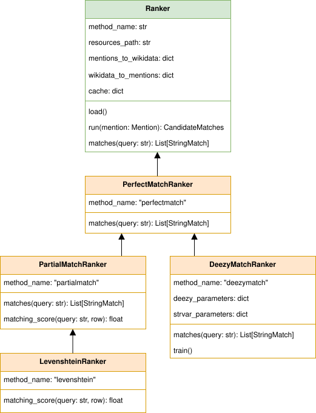

# Ranker

The Ranker takes the named entities detected by the Recogniser as input. Given a knowledge base, it ranks the entities names according to their string similarity to the target named entity, and selects a subset of candidates that will be passed on to the next component, the Linker, to do the disambiguation and select the most likely entity.

In order to use the Ranker and the Linker, we need a knowledge base, a gazetteer. T-Res uses a gazetteer which combines data from Wikipedia and Wikidata. See how to obtain the Wikidata-based resources in the "[Resources and file structure](../../getting-started/resources.md)" page in the documentation.

T-Res provides four different strategies for selecting candidates:

-   `perfectmatch` retrieves candidates from the knowledge base if one of their alternate names is identical to the detected named entity. For example, given the mention "Wiltshire", the following Wikidata entities will be retrieved: [Q23183](https://www.wikidata.org/wiki/Q23183), [Q55448990](https://www.wikidata.org/wiki/Q55448990), and [Q8023421](https://www.wikidata.org/wiki/Q8023421), because all these entities are referred to as "Wiltshire" in Wikipedia anchor texts.
-   `partialmatch` retrieves candidates from the knowledge base if there is a (partial) match between the query and the candidate names, based on string overlap. Therefore, the mention "Ashton-under" returns candidates for "Ashton-under-Lyne".
-   `levenshtein` retrieves candidates from the knowledge base if there is a fuzzy match between the query and the candidate names, based on levenshtein distance. Therefore, mention "Wiltshrre" would still return the candidates for "Wiltshire". This method is often quite accurate when it comes to OCR variations, but it is very slow.
-   `deezymatch` retrieves candidates from the knowledge base if there is a fuzzy match between the query and the candidate names, based on similarity between [DeezyMatch](https://github.com/Living-with-machines/DeezyMatch) embeddings. It is significantly more complex than the other methods to set up from scratch, and you will need to train a DeezyMatch model (which takes about two hours), but once it is set up, it is the fastest approach (except for `perfectmatch`).

## Ranker Classes

To perform candidate selection with T-Res you must first construct an instance of the `Ranker` class, as explained in [Section 1](#1-instantiate-the-ranker) below. The following diagram shows the class structure, with the abstract base class `Ranker` in green and its four concrete subclasses in orange. When constructing an instance, choose the appropriate subclass for your candidate selection method.

It can be seen that all subclasses extend the `PerfectMatchRanker` class. This is because every ranking method begins by attempting to find a perfect string match in the Wikidata knowledgebase. Only if this attempt is unsuccessful will a more flexible string matching method be attempted.

&nbsp;

{ width="560" } 

## 1. Instantiate the Ranker

### Perfect Match Ranker

To use the Ranker for exact matching (`perfectmatch`), instantiate it as follows:
```python
from t_res.geoparser import ranking

ranker = ranking.PerfectMatchRanker(
    resources_path="resources/"
)
```

Note that `resources_path` should contain the path to the directory where the Wikidata- and Wikipedia-based resources are stored, as described in the "[Resources and file structure](../../getting-started/resources.md)" page in the documentation.

### Partial Match & Levenshtein Rankers

To use the Ranker for partial string matching based on overlap distance (`partialmatch`), instantiate it as follows:
```python
from t_res.geoparser import ranking

ranker = ranking.PartialMatchRanker(
    resources_path="resources/"
)
```
Or, for partial string matching based on Levenshtein distance (`levenshtein`), use:
```python
from t_res.geoparser import ranking

ranker = ranking.LevenshteinRanker(
    resources_path="resources/"
)
```
Note that `resources_path` should contain the path to the directory where the Wikidata- and Wikipedia-based resources are stored, as described in the "[Resources and file structure](../../getting-started/resources.md)" page in the documentation.

### Deezy Match Ranker

DeezyMatch instantiation is trickier, as it requires training a model that, ideally, should capture the types of string variations that can be found in your data (such as OCR errrors). Using the Ranker, you can:

-   **Option 1:** Train a DeezyMatch model from scratch, including generating a string pairs dataset.
-   **Option 2:** Train a DeezyMatch model, given an existing string pairs dataset.

Once a DeezyMatch has been trained, you can load it and use it. The following notebooks provide examples of each case:

    ./examples/train_use_deezy_model_1.ipynb # Option 1
    ./examples/train_use_deezy_model_2.ipynb # Option 2
    ./examples/train_use_deezy_model_3.ipynb # Load an existing DeezyMatch model.

See below each option in detail.

#### Option 1. Train a DeezyMatch model from scratch, given an existing string pairs dataset

To train a DeezyMatch model from scratch, using an existing string pairs dataset, you will need to have the following ``resources`` file structure (as described in the "[Resources and file structure](resources.md)" page in the documentation):

    T-RES/
    ├── ...
    ├── resources/
    │   ├── deezymatch/
    │   │   ├── data/
    │   │   │   └── w2v_ocr_pairs.txt
    │   │   └── inputs/
    │   │       ├── characters_v001.vocab
    │   │       └── input_dfm.yaml
    │   ├── models/
    │   ├── news_datasets/
    │   ├── wikidata/
    │   │   ├── mentions_to_wikidata_normalized.json
    │   │   └── wikidata_to_mentions_normalized.json
    │   └── wikipedia/
    └── ...

The Ranker can then be instantiated as follows:

```python
from t_res.geoparser import ranking
from pathlib import Path

ranker = ranking.DeezyMatchRanker(
    # Generic Ranker parameters:
    resources_path="resources/",
    # Parameters to create the string pair dataset:
    strvar_parameters=dict(),
    # Parameters to train, load and use a DeezyMatch model:
    deezy_parameters={
        # Paths and filenames of DeezyMatch models and data:
        "dm_path": str(Path("resources/deezymatch/").resolve()),
        "dm_cands": "wkdtalts",
        "dm_model": "w2v_ocr",
        "dm_output": "deezymatch_on_the_fly",
        # Ranking measures:
        "ranking_metric": "faiss",
        "selection_threshold": 50,
        "num_candidates": 1,
        "verbose": False,
        # DeezyMatch training:
        "overwrite_training": False,
        "do_test": False,
    },
)
```

Description of the parameters (to learn more, refer to the [DeezyMatch readme](https://github.com/Living-with-machines/DeezyMatch/blob/master/README.md#candidate-ranking)):

-   `strvar_parameters` contains the parameters needed to generate the DeezyMatch training set. It can be left empty, since the training set already exists.
-   `deezy_parameters`: contains the set of parameters to train or load a DeezyMatch model:
    -   `dm_path`: The path to the folder where the DeezyMatch model and data will be stored.
    -   `dm_cands`: The name given to the set of alternate names from which DeezyMatch will try to find a match for a given mention.
    -   `dm_model`: Name of the DeezyMatch model to train (or load if the model already exists).
    -   `dm_output`: Name of the DeezyMatch output file (not really needed).
    -   `ranking_metric`: DeezyMatch parameter: the metric used to rank the string variations based on their vectors.
    -   `selection_threshold`: DeezyMatch parameter: selection threshold based on the ranking metric.
    -   `num_candidates`: DeezyMatch parameter: maximum number of string variations that will be retrieved.
    -   `verbose`: DeezyMatch parameter: verbose output or not.
    -   `overwrite_training`: Whether to overwrite the training of a DeezyMatch model provided it already exists.
    -   `do_test`: Whether to train a model in test mode.

#### Option 2. Train a DeezyMatch model from scratch, including generating a string pairs dataset

To train a DeezyMatch model from scratch, including generating a string pairs dataset, you will need to have the following `resources` file structure (as described in the "[Resources and file structure](../../getting-started/resources.md)" page in the documentation):

    T-RES/
    ├── ...
    ├── resources/
    │   ├── deezymatch/
    │   ├── models/
    │   │   └── w2v/
    │   │       ├── w2v_1800s_news
    │   │       │   ├── w2v.model
    │   │       │   ├── w2v.model.syn1neg.npy
    │   │       │   └── w2v.model.wv.vectors.npy
    │   │       ├── ...
    │   │       └── w2v_1860s_news
    │   │           ├── w2v.model
    │   │           ├── w2v.model.syn1neg.npy
    │   │           └── w2v.model.wv.vectors.npy
    │   ├── news_datasets/
    │   ├── wikidata/
    │   │   ├── mentions_to_wikidata_normalized.json
    │   │   └── wikidata_to_mentions_normalized.json
    │   └── wikipedia/
    └── ...

The Ranker can then be instantiated as follows:

```python
from t_res.geoparser import ranking
from pathlib import Path

ranker = ranking.DeezyMatchRanker(
    # Generic Ranker parameters:
    resources_path="resources/",
    # Parameters to create the string pair dataset:
    strvar_parameters={
        "ocr_threshold": 60,
        "top_threshold": 85,
        "min_len": 5,
        "max_len": 15,
        "w2v_ocr_path": str(Path("../resources/models/w2v/").resolve()),
        "w2v_ocr_model": "w2v_*_news",
        "overwrite_dataset": False,
    },
    # Parameters to train, load and use a DeezyMatch model:
    deezy_parameters={
        # Paths and filenames of DeezyMatch models and data:
        "dm_path": str(Path("resources/deezymatch/").resolve()),
        "dm_cands": "wkdtalts",
        "dm_model": "w2v_ocr",
        "dm_output": "deezymatch_on_the_fly",
        # Ranking measures:
        "ranking_metric": "faiss",
        "selection_threshold": 50,
        "num_candidates": 1,
        "verbose": False,
        # DeezyMatch training:
        "overwrite_training": False,
        "do_test": False,
    },
)
```

Description of the parameters (to learn more, refer to the [DeezyMatch readme](https://github.com/Living-with-machines/DeezyMatch/blob/master/README.md#candidate-ranking)):

-   `strvar_parameters` contains the parameters needed to generate the DeezyMatch training set:
    -   `ocr_threshold`: Maximum [FuzzyWuzzy](https://pypi.org/project/fuzzywuzzy/) ratio for two strings to be considered negative variations of each other.
    -   `top_threshold`: Minimum [FuzzyWuzzy](https://pypi.org/project/fuzzywuzzy/) ratio for two strings to be considered positive variations of each other.
    -   `min_len`: Minimum length for a word to be included in the dataset.
    -   `max_len`: Maximum length for a word to be included in the dataset.
    -   `w2v_ocr_path`: The path to the word2vec embeddings folders.
    -   `w2v_ocr_model`: The folder name of the word2vec embeddings (it can be a regular expression).
    -   `overwrite_dataset`: Whether to overwrite the dataset if it already exists.
-   `deezy_parameters`: contains the set of parameters to train or load a DeezyMatch model:
    -   `dm_path`: The path to the folder where the DeezyMatch model and data will be stored.
    -   `dm_cands`: The name given to the set of alternate names from which DeezyMatch will try to find a match for a given mention.
    -   `dm_model`: Name of the DeezyMatch model to train or load.
    -   `dm_output`: Name of the DeezyMatch output file (not really needed).
    -   `ranking_metric`: DeezyMatch parameter: the metric used to rank the string variations based on their vectors.
    -   `selection_threshold`: DeezyMatch parameter: selection threshold based on the ranking metric.
    -   `num_candidates`: DeezyMatch parameter: maximum number of string variations that will be retrieved.
    -   `verbose`: DeezyMatch parameter: verbose output or not.
    -   `overwrite_training`: Whether to overwrite the training of a DeezyMatch model provided it already exists.
    -   `do_test`: Whether to train a model in test mode.

## 2. Load the resources

!!! title "Note"

    Note that this step is already taken care of if you use the default [T-Res Pipeline](./index.md).

The following line of code loads the resources (i.e. the `mentions-to-wikidata_normalized.json` and `wikidata_to_mentions_normalized.json` files into dictionaries). They are required in order to perform candidate selection and ranking, regardless of the Ranker method.

```python
ranker.load()
```

## 3. Train a DeezyMatch model

!!! title "Note"

    Note that this step is already taken care of if you use the default [T-Res Pipeline](./index.md).

The following line will train a DeezyMatch model, given the arguments specified when instantiating the Ranker.

```python
ranker.train()
```

Note that if the model already exists and `overwrite_training` is set to `False`, the training will be skipped, even if you call the `train()` method. The training will also be skipped if the Ranker is instantiated for a different method than DeezyMatch.

The resulting model will be stored in the specified path. In this case, the resulting DeezyMatch model that the Ranker will use is called `w2v_ocr`:

    T-RES/
    ├── ...
    ├── resources/
    │   ├── deezymatch/
    │   │   └── models/
    │   │       └── w2v_ocr/
    │   │           ├── input_dfm.yaml
    │   │           ├── w2v_ocr.model
    │   │           ├── w2v_ocr.model_state_dict
    │   │           └── w2v_ocr.vocab
    │   ├── models/
    │   ├── news_datasets/
    │   ├── wikidata/
    │   │   ├── mentions_to_wikidata_normalized.json
    │   │   └── wikidata_to_mentions_normalized.json
    │   └── wikipedia/
    └── ...

## 4. Retrieve candidates for a given mention

In order to use the Ranker to retrieve candidates for a given mention, follow the example. The Ranker's `run` method requires that the input is a list of `Mention` instances. Here we assume the `mentions` variable is such a list, obtained by executing the [`Recogniser`](recogniser.md) on a sentence of text:
```python
candidate_matches = ranker.run(mentions)
print(candidate_matches)
```
The result is a list of `CandidateMatches` instances.

&nbsp;
